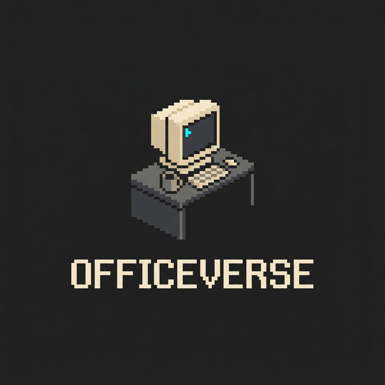
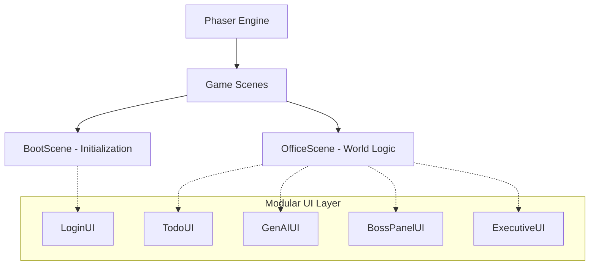

# 🏢 OfficeVerse

<div align="center">
  
  <br/><br/>
  
</div>

_Work, Collaborate, and Have Fun in Your Virtual Office!_

[](https://officeverse.netlify.app/)
[](https://github.com/zoo-hair/OfficeVerse-)

[](./LICENSE)


[Live Demo](#live-demo) • [Quick Start](#quick-start) • [Features](#features) • [Controls](#controls) • [Architecture](#architecture)

---

## Live Demo

> **Access OfficeVerse here →** [https://officeverse.netlify.app/](https://officeverse.netlify.app/)

**OfficeVerse** isn't just another productivity tool—it's a living, breathing digital ecosystem. It transforms the mundane remote work experience into a vibrant, interactive pixel world.

> [!IMPORTANT]
> **Why OfficeVerse?** Because Zoom fatigue is real. OfficeVerse brings back the "water cooler" moments, the desk-side chats, and the feeling of belonging to a team, all within a beautiful, gamified environment.

### ✨ Experience the Magic

- 🤝 **Seamless Collaboration** — Real-time presence without the camera pressure.
- 🤖 **AI-Powered Sidekick** — Your personal assistant, powered by Mistral AI.
- 🎨 **Your Persona** — Multiple characters and customizable skins to express yourself.
- 🎮 **Work-Life Balance** — Integrated gaming zones for those much-needed breaks.

---

## 🚀 Epic Features

| Feature                       | The Vibe                                                                               |
| :---------------------------- | :------------------------------------------------------------------------------------- |
| 🗺️ **Living Office Map**      | From the **Zen Garden** to the **Boss's Executive Suite**, every corner has a purpose. |
| 👥 **Hyper-Sync Multiplayer** | Smooth movement and real-time synchronization that feels like magic.                   |
| 💬 **Rich Communication**     | Global chat, private whispers, and **P2P Voice Calls** for true connection.            |
| 🤖 **AI Assistant**           | A context-aware Mistral AI companion ready to brainstorm with you.                     |
| 📋 **Smart Desks**            | Personal task management that stays where you left it.                                 |
| 📊 **Vitals Engine**          | Manage your **Energy** ⚡ and **Stress** 😫 to stay at peak performance.               |

---

## 🏗️ Smart Architecture

OfficeVerse uses a cutting-edge **Modular UI-Scene Separation** pattern, ensuring the game stays fast and the code stays clean.



---

## 🛠️ Tech Stack

| Frontend       | Backend         | Security           |
| :------------- | :-------------- | :----------------- |
| Phaser 3.80    | Spring Boot 4.0 | CORS Guard         |
| Vite           | WebSockets      | Input Sanitization |
| WebRTC (Voice) | Mistral AI      | Server-side Keys   |
| Tailored CSS   | H2 Database     |                    |

---

## 📦 Quick Start

### 1. Fire up the Server

```bash
cd officeVerse_server
gradle bootRun
```

### 2. Launch the Client

```bash
cd officeVerse_client
npm install
```

Open `http://localhost:5173` and start your new work life! 🚀

---

## 🎮 Master the Controls

> [!TIP]
> Use the **Zen Room** (🧘) when your stress gets high to turn your avatar blue and find your inner peace!

| Command         | Action                   |
| :-------------- | :----------------------- |
| `Arrows / WASD` | Navigate the OfficeVerse |
| `F`             | Interact with the World  |
| `E`             | Chat with Colleagues     |
| `Enter`         | Submit / Send            |

---

## 📚 Documentation

For detailed information, please refer to our manuals:

- 📖 [User Manual](./UserManual.md) — How to play, key controls, and features.
- 🎨 [Frontend Manual](./FrontEndManual.md) — Client setup, architecture, and development.
- ⚙️ [Backend Manual](./BackendManual.md) — Server setup, technology stack, and API.
- 🤝 [Contribution Manual](./ContributionManual.md) — Guidelines for contributing to OfficeVerse.

---

## 🤝 Contributing

We welcome contributions! Please follow these steps:

1. Fork the repository.
2. Create a feature branch (`git checkout -b feature/AmazingFeature`).
3. Commit your changes (`git commit -m 'Add some AmazingFeature'`).
4. Push to the branch (`git push origin feature/AmazingFeature`).
5. Open a Pull Request.

## 🤝 Meet The Team Alpha 

<div align="center">
  <br/>
  <a href="https://github.com/zoo-hair">
    
  </a>
  &nbsp;&nbsp;&nbsp;&nbsp;&nbsp;&nbsp;&nbsp;
  <a href="https://github.com/HEISENBERG1792">
    
  </a>
  &nbsp;&nbsp;&nbsp;&nbsp;&nbsp;&nbsp;&nbsp;
  <a href="https://github.com/nayemul-h">
    
  </a>
  <br/>
  <br/>

  <table>
    <tr>
      <td align="center" width="200">
        <b>💻 <a href="https://github.com/zoo-hair">Juhair Islam Sami</a></b><br/>
        <i>"The Architect"</i>
      </td>
      <td align="center" width="200">
        <b>🚀 <a href="https://github.com/HEISENBERG1792">Abrar Khan</a></b><br/>
        <i>"The Optimizer"</i>
      </td>
      <td align="center" width="200">
        <b>💡 <a href="https://github.com/nayemul-h">Md Nayemul Hasan</a></b><br/>
        <i>"The Visionary"</i>
      </td>
    </tr>
  </table>
  <br/>
  <p>
    
  </p>
</div>

## 📄 License

Distributed under the MIT License. See `LICENSE` for more information.

---

### **Ready to redefine how you work?**

[User Manual](./UserManual.md) • [Issues](https://github.com/zoo-hair/ov/issues)

**Copyright © 2026 OfficeVerse Team**
_Made with ❤️ and pixel dust._
